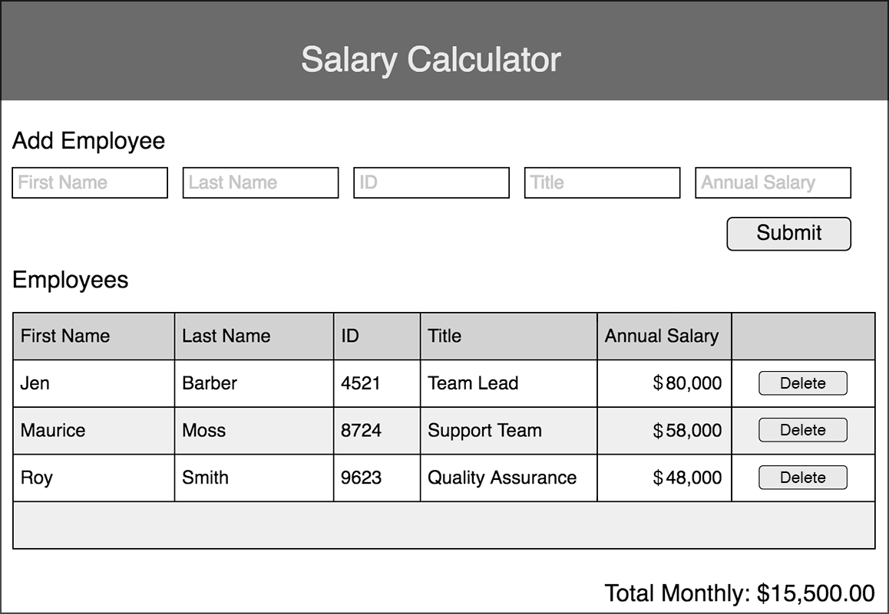

# Weekend Challenge: jQuery Salary Calculator
Create an application that records employee salaries and adds salaries up to report monthly costs. 

## Topics Covered
- JavaScript
- jQuery - Selectors, append, and event handling

## Assignment

The application should have an input form that collects _employee first name, last name, ID number, job title, annual salary_.

A 'Submit' button should collect the form information, store the information to calculate monthly costs, append information to the DOM and clear the input fields. Using the stored information, calculate monthly costs and append this to the to DOM. If the total monthly cost exceeds $20,000, add a red background color to the total monthly cost.

Create a delete button that removes an employee from the DOM. For Base mode, it does **not** need to remove that Employee's salary from the reported total.

### Files Provided
No files have been provided. Fork and clone this repository or create a new GitHub repository to get started. Make sure to commit regularly!

### Wireframe

